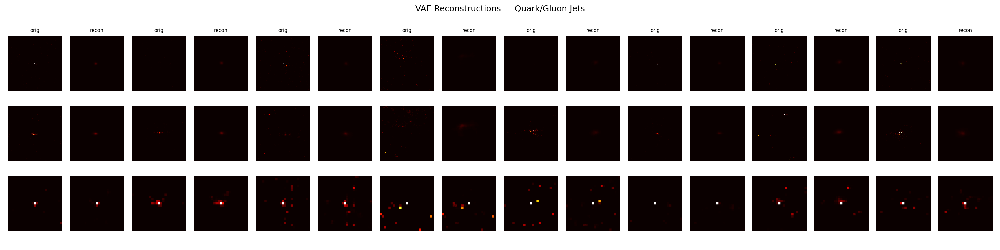
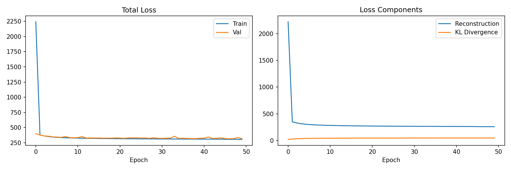

# ML4SCI DeepFalcon — GSoC 2026

## Common Task 1: Variational Autoencoder for Quark/Gluon Jet Events

### Dataset
Quark/Gluon jet images — 3 channels (ECAL, HCAL, Tracks), 125×125 pixels.  
139,306 total samples. Trained on 50,000 due to memory constraints.

### Model
Convolutional VAE with:
- Encoder: 5 stride-2 conv layers → 256-dimensional latent space
- Decoder: 5 transposed conv layers → reconstructed image
- Loss: Binary Cross Entropy + KL Divergence

### Results
- Best validation loss: 315.3
- Training: 50 epochs, batch size 128, Adam optimizer (lr=1e-3)

### Reconstructions


### Loss Curves


### Requirements
```
pip install torch h5py numpy matplotlib
```

### Usage
Open `common_task1_vae.ipynb` and run all cells top to bottom.
Dataset file `quark-gluon_data-set_n139306.hdf5` must be in the same directory.
The dataset is not tracked in this repo (~700 MB) — download it separately.

### Interactive explorer

`vae_gui.py` is a [Flet](https://flet.dev) desktop app for browsing jet events
and inspecting VAE reconstructions without opening the notebook.

```
pip install flet scipy numpy matplotlib
flet run vae_gui.py        # desktop window
python vae_gui.py          # headless / web mode
```

It picks up the trained weights automatically if `vae_best.pt` sits next to it,
and falls back to synthetic jets otherwise. `sample_quark_jet.npy` (with a
`.png` preview) is a single real event bundled for use as a loadable sample.
