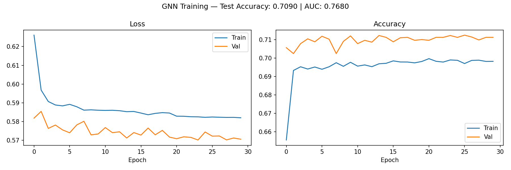

# Common Task 2: Graph Neural Network for Quark/Gluon Jet Classification

## Approach

Jet images are converted to graphs and classified using a Graph Convolutional 
Network (GCN). Rather than processing the full 125×125 pixel grid, only active 
(non-zero) pixels are kept, reducing each jet to a sparse point cloud of energy 
deposits which is then cast into a graph.

## Pipeline

1. **Image → Point Cloud**: Extract non-zero pixels. Each active pixel becomes 
   a point with its (row, col) position and (ECAL, HCAL, Tracks) energy values.

2. **Point Cloud → Graph**: Connect each point to its 8 spatially nearest 
   neighbors using a k-NN graph. Each point is a node with 3 energy features. 
   Edges encode spatial proximity between detector hits.

3. **GNN Classification**: A 3-layer GCN performs message passing across the 
   graph, global mean pooling aggregates node representations into a single 
   jet-level vector, and a 2-layer classifier outputs quark/gluon predictions.

## Model

- GCNConv(3 → 64) → ReLU
- GCNConv(64 → 128) → ReLU
- GCNConv(128 → 256) → ReLU
- Global Mean Pool
- Linear(256 → 64) → ReLU
- Linear(64 → 1)

Total parameters: 58,113

## Results

| Metric        | 5,000 jets | 50,000 jets |
|---------------|------------|-------------|
| Test Accuracy | 70.4%      | 70.9%       |
| Test AUC      | 0.74       | 0.77        |



## Training

- Dataset: 50,000 jets (80/10/10 train/val/test split)
- Epochs: 30
- Batch size: 64
- Optimizer: Adam (lr=1e-3)
- Scheduler: ReduceLROnPlateau (patience=5, factor=0.5)

## Requirements
```bash
pip install torch torch-geometric torch-scatter torch-sparse torch-cluster
pip install h5py numpy matplotlib scikit-learn tqdm
```

## Usage

Open `common_task2_gnn.ipynb` and run all cells top to bottom.  
Dataset file `quark-gluon_data-set_n139306.hdf5` must be in the same directory.  
GPU recommended.
